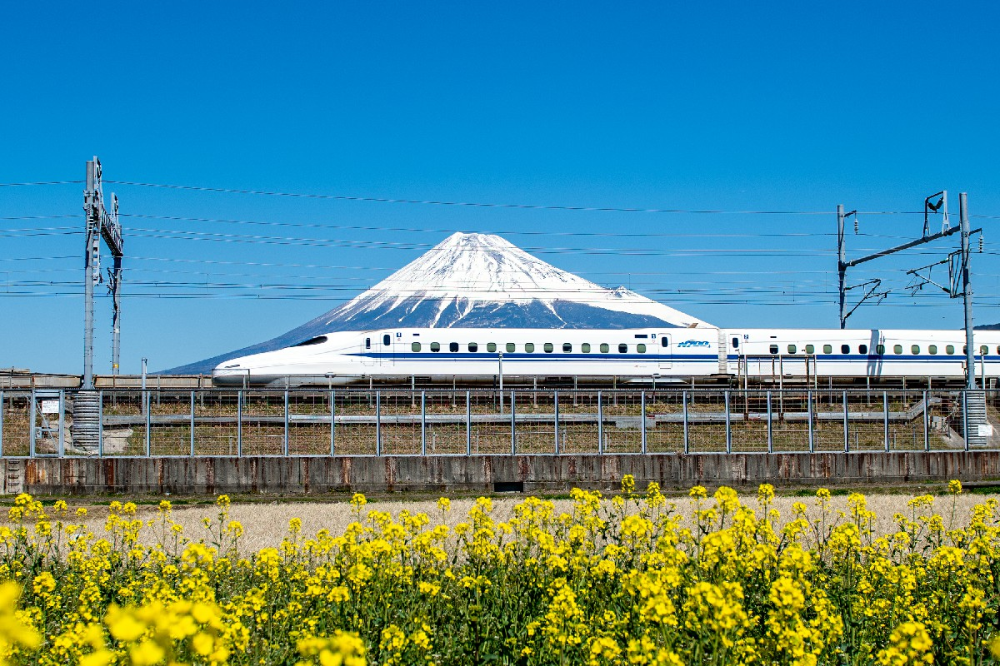
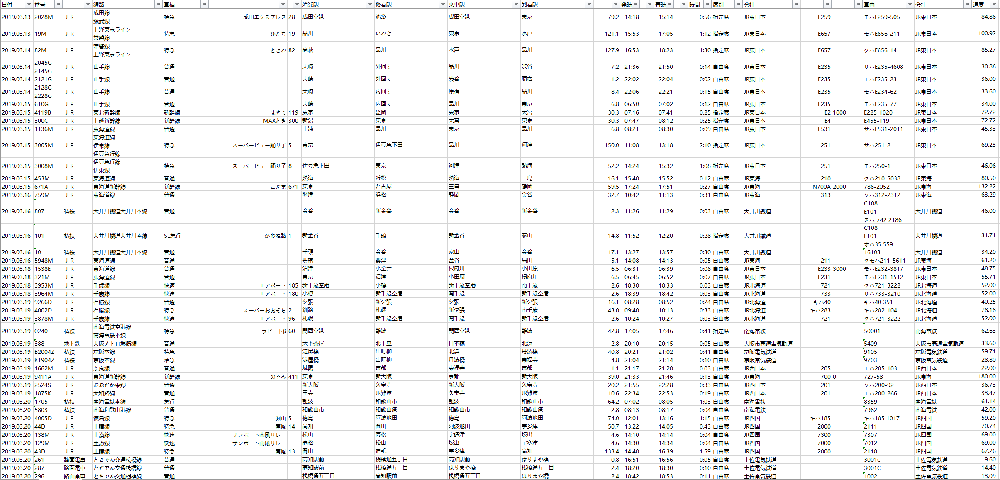
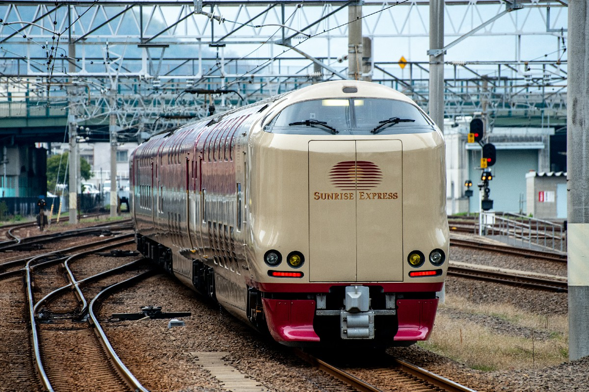
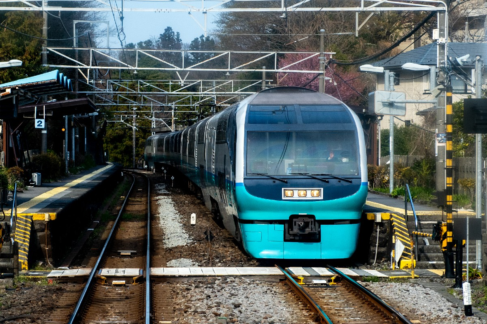
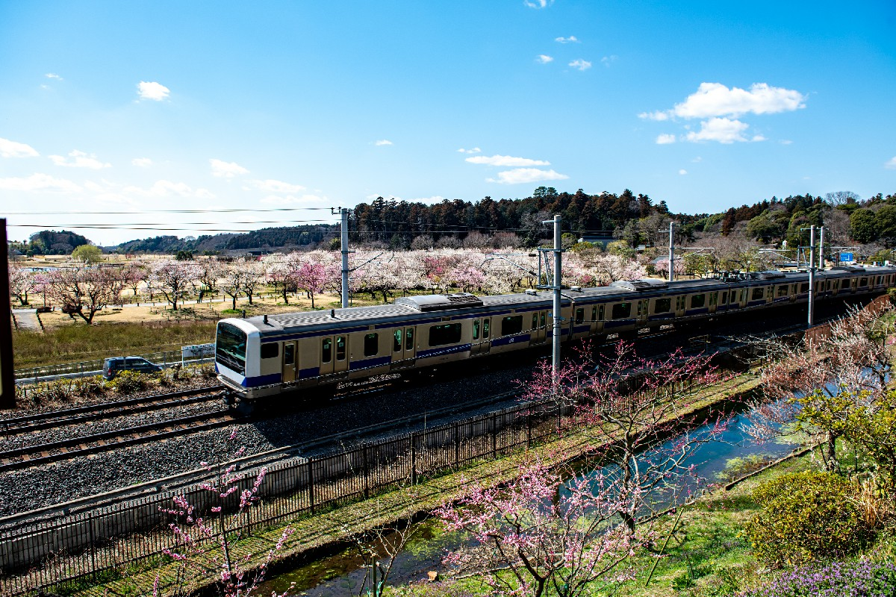
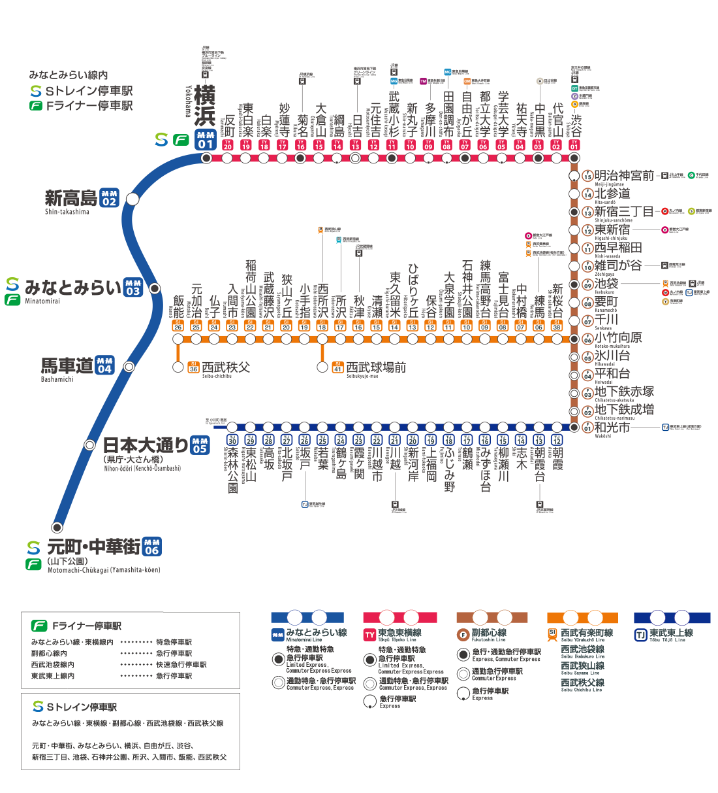
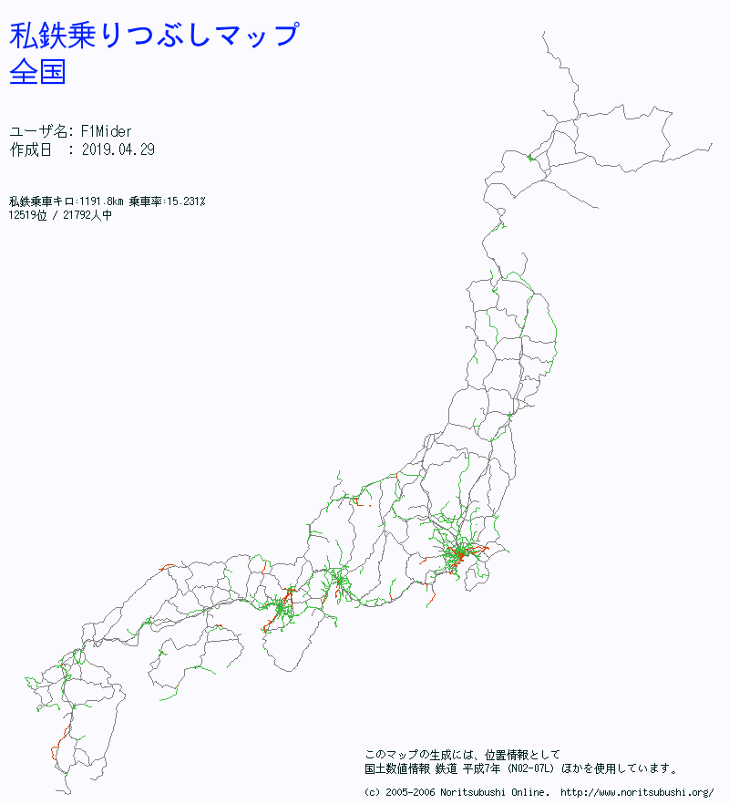
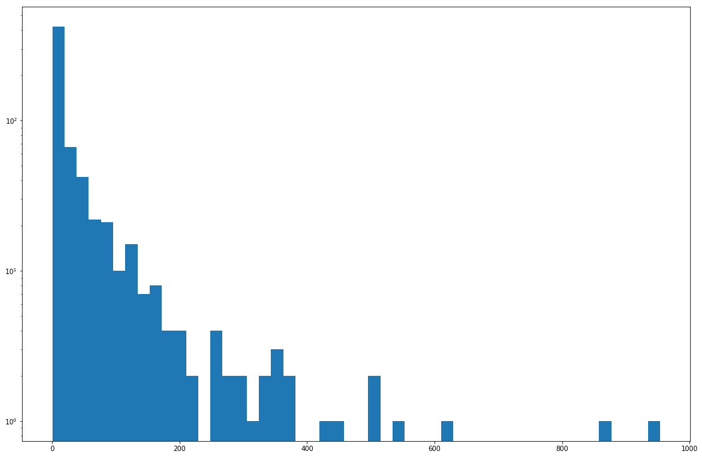
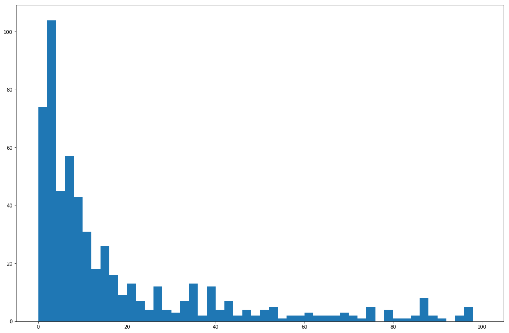
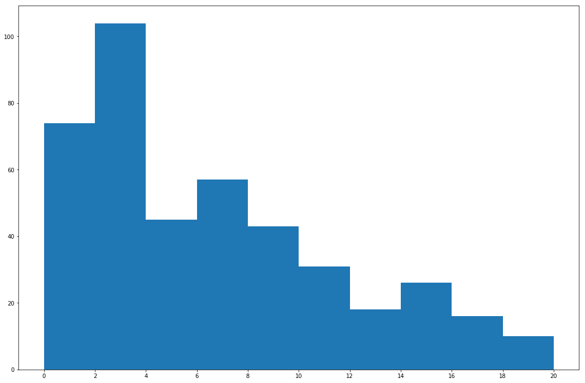

# Visualizing train rides in Japan

---

# The data itself is complicated.

---

# The train system is complicated.

And they all go to the same chart.

---

---

---

---

---

---

---

# The complication is in different ways

For example, this system map involves five different companies

source: http://www.mm21railway.co.jp/info/route_map.html

---

# There isn't anything that helped you visualize anything.

Except

http://www.noritsubushi.org/

But only for railways that you've been to, not for each record

---

---

---

# A histogram of distance of train rides

---

# Histograms of distance of train rides

---

# Histograms of distance of train rides

---

# Some more data that are used

http://nlftp.mlit.go.jp/ksj/gml/datalist/KsjTmplt-N02-v2_3.html

* The railroad and stations data as of H29.12.31 (2017.12.31) by 
the Ministry of Land, Infrastructure, Transport and Tourism (MLIT) in Japan.
* Allowed use for both commercial and noncommercial purposes.
* Free

http://www.ekidata.jp/

* Station, company, route info as of 2019.4.5 by ekidata.jp
* Allowed use for both commercial and noncommercial purposes
* Free, but missing some data compared to paid plan

---

# The first graph

+ Used kepler.gl
+ Use the MLIT data as background
+ Plot all stations that have been to
+ Plus, connecting each depart and arrive station

- Sadly, only with straight line
- And you cannot really do anything else from it

---

<!-- .slide: data-background-iframe="https://f1mider.github.io/spr2019-adv-project/kepler.html" data-background-interactive -->

---

# The second graph

+ Used Vega-Lite
+ Use the MLIT data as background
+ Plot all stations that have been to
+ Shows statictics for selected points

- No, vega-lite does not support zoom in for geoshape
- And you actually have to have a Japan map ready yourself
- And it's slow, really

---

<!-- .slide: data-background-iframe="https://f1mider.github.io/spr2019-adv-project/vegalite.html" data-background-interactive -->

