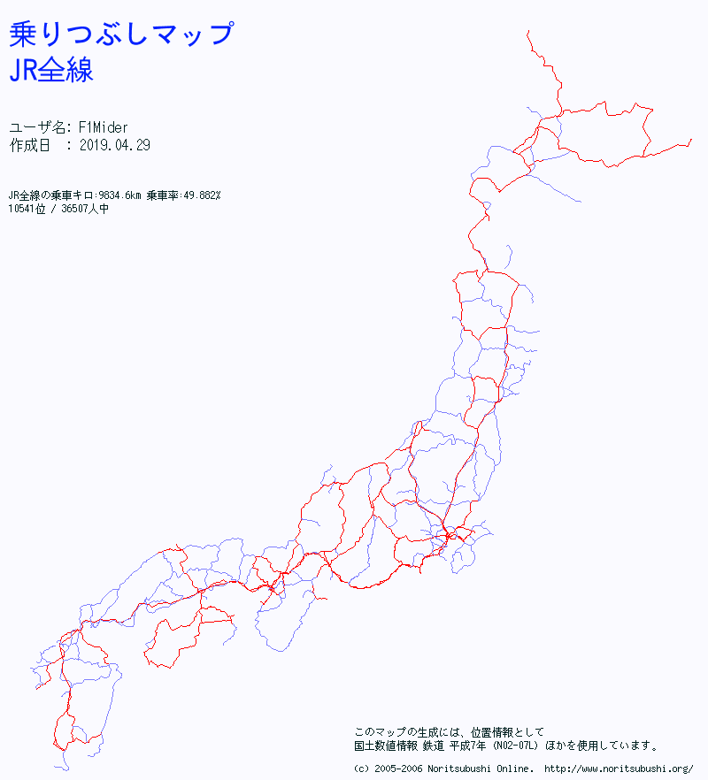

# Visualizing train rides in Japan

---

## It is complicated in different ways

For example, this system map involves five different companies  

  

source: http://www.mm21railway.co.jp/info/route_map.html

---

## The data itself is complicated

---

## The train system is complicated

And they all go to the same chart.

---

---

---

---

---

---

---

## There isn't anything that helped you visualize anything

Except

http://www.noritsubushi.org/   

But only for railways that you've been to, not for each record

---

---

---

## A histogram of distance of train rides

---

## Histograms of distance of train rides

---

## Histograms of distance of train rides

---

## Some more data that are used

http://nlftp.mlit.go.jp/ksj/gml/datalist/KsjTmplt-N02-v2_3.html

* The railroad and stations data as of H29.12.31 (2017.12.31) 
* by the Ministry of Land, Infrastructure, Transport and Tourism (MLIT) in Japan.
* Allowed use for both commercial and noncommercial purposes.
* Free

http://www.ekidata.jp/

* Station, company, route info as of 2019.4.5 by ekidata.jp
* Allowed use for both commercial and noncommercial purposes
* Free, but missing some data compared to paid plan

---

## The first graph

* Use kepler.gl
* Use the MLIT data as background
* Plot all stations that have been to
* Plus, connecting each depart and arrive station
* Sadly, only with straight line
* Somehow, the brushing is not working the same way as it was
* And you cannot really do anything from it

---

<!-- .slide: data-background-iframe="./kepler.html" data-background-interactive -->

---

## The second graph

* Used Vega-Lite
* Use the MLIT data as background
* Plot all stations that have been to
* Shows statictics for selected station
* As well as stations to/from that selected one
* No, vega-lite does not support zoom in for geoshape
* And you actually have to have a Japan map ready yourself
* And it's slow, really

---

<!-- .slide: data-background-iframe="./vegalite.html" data-background-interactive -->

---

# Thank you!

