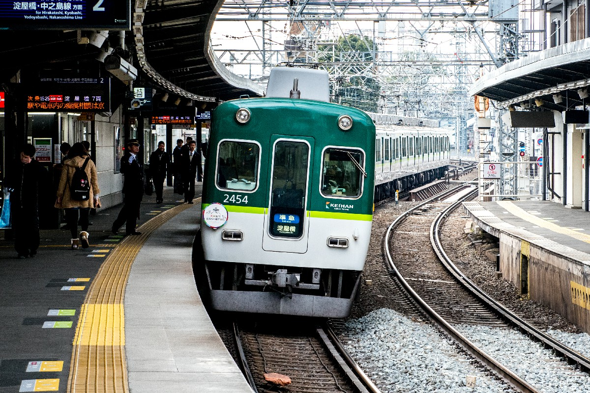

# Visualizing train rides in Japan

---

# The data itself is complicated.

---

# The train system is complicated.

---

---

---

---

---

---

---

# A histogram of distance of train rides

---

# Histograms of distance of train rides

---

# Histograms of distance of train rides

---

# Some more data that are used

http://nlftp.mlit.go.jp/ksj/gml/datalist/KsjTmplt-N02-v2_3.html

* The railroad and stations data as of H29.12.31 (2017.12.31) by the Ministry of Land, Infrastructure, Transport and Tourism in Japan.
* Allowed use for both commercial and noncommercial purposes.
* Free

---

# Some more data that are used

http://www.ekidata.jp/

* Station, company, route info as of 2019.4.5 by ekidata.jp
* Allowed use for both commercial and noncommercial purposes
* Free, but missing some data compared to paid plan

---

<!-- .slide: data-background-iframe="https://f1mider.github.io/spr2019-adv-project/kepler.html" data-background-interactive -->

---

<!-- .slide: data-background-iframe="https://f1mider.github.io/spr2019-adv-project/vegalite.html" data-background-interactive -->

